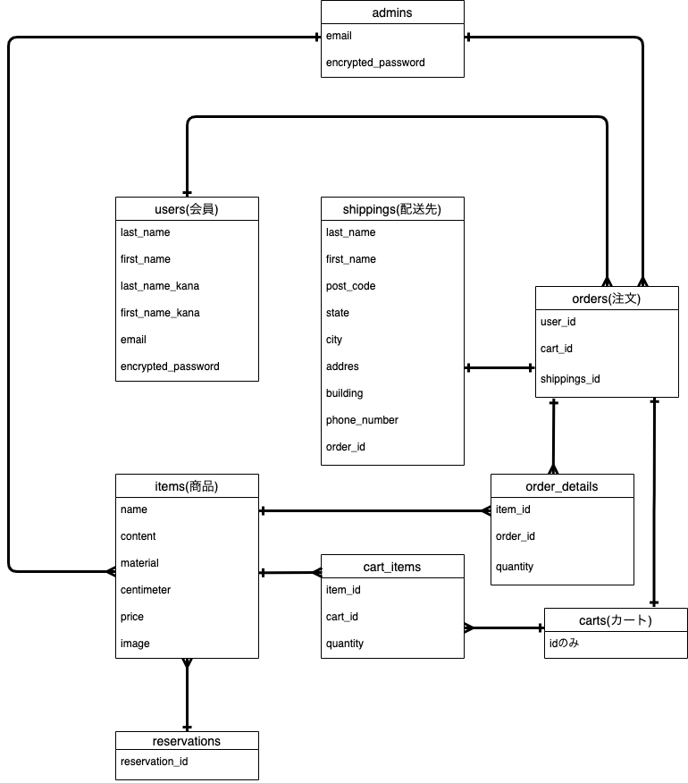

# アプリケーション名  
NUAX
# アプリケーション概要  
ECサイト
# 作成した経緯
自身でファッションブランドの活動をしている際、ホームページを作成する機会があった。その際のスキルではEC機能の実装ができなかった。  
今回、自身のスキルアップ確認も含めECサイトを実装することにした。
# URL  
http://54.199.190.174/
# テスト用アカウント  
* ID:test@test 
* PW:test1111 
# 利用方法  
## ユーザー登録
1. ヘッダーの「LOGIN」ボタンより、ログイン画面へ遷移する
2. 「新規登録はこちら」ボタンを押下することで、新規登録ページへ遷移する
3. 必要情報を入力する事でユーザー登録ができる

## カートの操作方法  
1. トップページ(一覧ページ)から、該当商品を押下することで、商品詳細ページへ遷移する。
2. 「カートに入れる」ボタンを押下することで、カートに商品を追加する。
3. ヘッダー「CART」ボタンを押下することで、カート一覧を表示する
4. カート一覧より、該当商品の削除ボタンを押下することで、カート内商品を削除できる

## 購入手続き
1. ヘッダー「CARTボタンより、カート一覧画面へ遷移する。
2. カート内に商品が入っている場合、「お支払いへ進む」ボタンを押下することで、購入手続きのページへ遷移する
3. クレジットカード情報と配送先情報を全て入力し、「購入手続きを完了する」ボタンを押下することで、決済が完了する。

# アプリケーションを作成した背景  
自身でレディースファッションブランドを立ち上げ、活動していた。以前の技術では実装できなかった、ECサイトのアプリケーションを開発することにした。  

# 洗い出した要件  
https://docs.google.com/spreadsheets/d/1_uXY4mwR4Cr-SdSwWo-leKcw_xLSx03S7po3Suau5zA/edit#gid=982722306  
※黄色い箇所は今後追加実装予定

# 実装した機能についての画像やGIFおよびその説明  
* ユーザー管理機能
https://gyazo.com/31c0068aa4059570a3f3241b67d8f536
* 商品出品・編集・削除機能(管理者権限)
https://gyazo.com/1e779f18fa587c725b10055e5f9d6c22
* カート機能(ログインしていない場合はセッションを利用)
https://gyazo.com/1e779f18fa587c725b10055e5f9d6c22
* 購入機能  
https://gyazo.com/65cb5bd0373861cc892ae2b7f98f4d5f
# 実装予定の機能  
* トップページの実装(javascriptのthree.jsを用いた、3Dモデルを予定)
* マイページ機能(メアド/パスワードの変更機能・注文履歴確認)
* 注文履歴の一覧表示機能(管理者権限)

# データベース設計  

# 画面遷移図  

# 開発環境  
* フロントエンド
* バックエンド
* インフラ
* テスト
* テキストエディタ
* タスク管理

# ローカルでの動作方法  
以下のコマンドを順に実行  
% git clone https://github.com/ap0424ts/nuax_official.git  
% cd nuax_official  
% bundle install  
% yarn install  

# 工夫したポイント  
sessionを利用し、ログインの可否に関わらずカートへ商品を追加出来るようにした。
また、管理者権限としてアイテムの出品・編集・削除機能を付与。